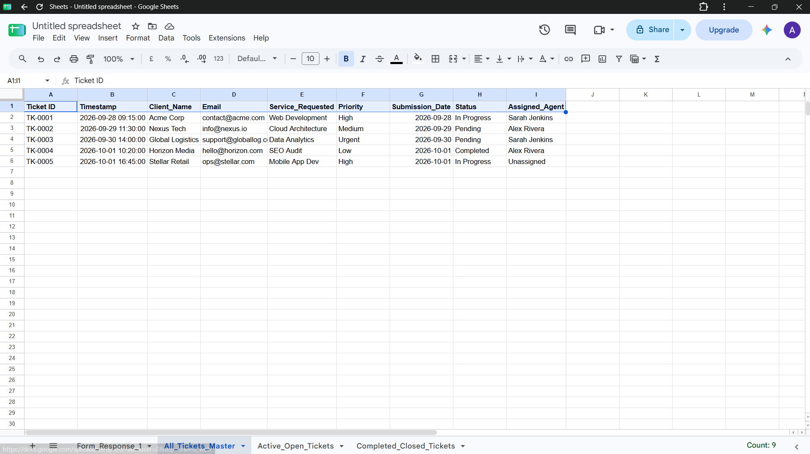
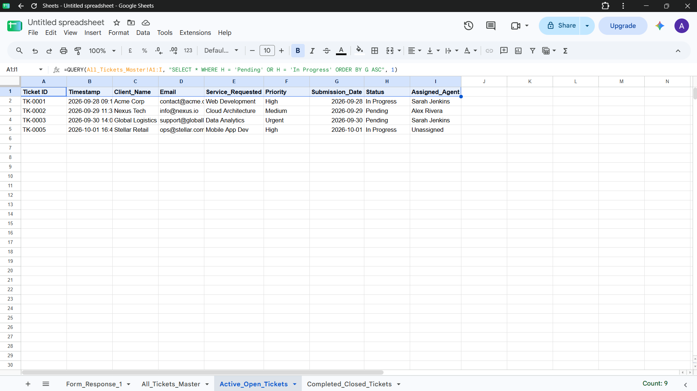

# Automated Google Forms Client Status Tracker & ETL Engine

## 📌 Business Overview
Designed and deployed an automated ticket generation and client tracking engine in Google Sheets to replace manual data entry workflows. Raw incoming requests from Google Forms are dynamically transformed into structured master tickets and routed to dedicated operational tabs using array formulas and relational query logic.

## 📊 Operational Architecture & Proof of Work
### Master Ticket Processing Engine


### Dynamic Active Open Tickets Console


## 🏗️️ Technical Implementation & Data Flow
1. **Raw Submission Feed (`Form_Response_1`)**: Enforces structured data entry for client onboarding requests.
2. **Auto-Ticket ID Generation**: Uses `ARRAYFORMULA` and `ROW()` mapping to systematically generate non-colliding IDs (`TK-0001`, `TK-0002`, etc.) upon form submission.
3. **Dynamic Routing Engine**: Employs SQL-style `QUERY()` statements to isolate active work orders (`Pending`, `In Progress`) from finished cases (`Completed`) without formula degradation.
4. **SLA Overdue Alerts**: Implemented rule-based conditional formatting highlighting unresolved client requests aged over 48 hours.

## 🛠️ Core Formula Scripts

### Master Ticket Generator (`All_Tickets_Master`)
```excel
=ARRAYFORMULA(IF(ISBLANK('Form_Response_1'!A2:A), "", "TK-" & TEXT(ROW('Form_Response_1'!A2:A)-1, "0000")))
=ARRAYFORMULA('Form_Response_1'!A2:H)
